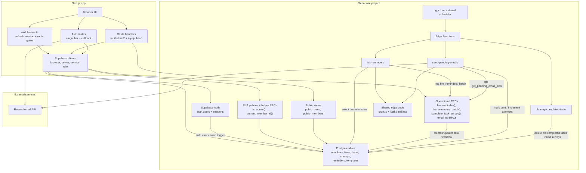

# Supabase Architecture

This project uses Supabase for authentication, row-level authorization, Postgres data storage, scheduled operational workflows, RPC helpers, and public read-only views.

## Structure

## Runtime Flows

### Authentication and Authorization

- `src/lib/supabase/client.ts` creates the browser Supabase client for session-aware client components.
- `src/lib/supabase/server.ts` creates a cookie-backed server client for route handlers and a service-role client for privileged server work.
- `src/lib/supabase/proxy.ts` is used by `middleware.ts` to refresh sessions, route unauthenticated users, and gate `/reminders` and `/members` with `is_admin()`.
- `supabase/migrations/20260517045959_rls_setup.sql` links `public.members.user_id` to `auth.users.id` using an auth trigger and defines the RLS helper RPCs `current_member_id()` and `is_admin()`.

### Data Access

- Admin route handlers use the cookie-backed server client against `members`, `trees`, `tasks`, `surveys`, `reminders`, and `templates`.
- Public map data reads from `public_trees`, a controlled view over `trees`.
- Public member display data is exposed through `public_members`.
- Public survey submission inserts into `surveys`, then calls `complete_task_survey(p_task_id)` to decrement `tasks.surveys_needed` and complete the task when enough surveys have been submitted.

### Reminder and Email Automation

- `tick-reminders` finds active reminders with `next_run_at <= now()`, computes the next run time in Pacific time using `_shared/cron.ts`, then calls `fire_reminders_batch(reminder_ids, next_run_ats)`.
- `fire_reminders_batch()` wraps an existing `fire_reminder()` database function and isolates failures per reminder.
- `send-pending-emails` pulls pending task email jobs through `get_pending_email_jobs`, renders `_shared/emails/TaskEmail.tsx`, sends a Resend batch, marks successful tasks with `email_sent_at`, and calls `increment_email_attempts` for failures.
- `cleanup-completed-tasks` deletes surveys linked to completed tasks older than 30 days, then deletes those old completed tasks.

## Migrations in This Repo

- `20260517045959_rls_setup.sql`: auth-member linking, RLS, public tree view, grants.
- `20260517050050_update_public_trees_view.sql`: adds `tree_keeper_id` to `public_trees`.
- `20260517050310_update_public_trees_view_with_id.sql`: adds `id` to `public_trees`.
- `20260517051007_public_members_view.sql`: creates `public_members` and denormalizes keeper names into `public_trees`.
- `20260519185859_fire_reminders_batch.sql`: adds batched reminder firing RPC.
- `20260521000000_complete_task_survey.sql`: adds survey-completion RPC.
- `20260521000001_cleanup_completed_tasks_cron.sql`: schedules cleanup function with placeholder project URL and anon key.

## Notes

- `fire_reminder`, `get_pending_email_jobs`, and `increment_email_attempts` are present in generated database types and used by edge functions, but their defining migrations are not present in this repo.
- Only `cleanup-completed-tasks` has a visible scheduling migration, and that migration still contains placeholder URL/token values. No repo migration currently schedules `tick-reminders` or `send-pending-emails`.
